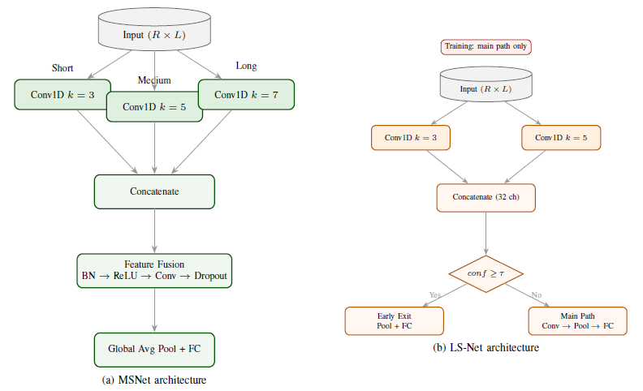

# MRMS-Net / LMRMS-Net

**Multi-Scale Representation Networks for Time Series Classification**

Official PyTorch implementation of **MRMS-Net** and **LMRMS-Net**, two convolutional architectures designed for efficient and robust **time series classification (TSC)**.

The models exploit **multi-scale temporal representations** using parallel convolutional branches while maintaining strong computational efficiency.

This repository provides:

* Reference implementations of **MRMS-Net** and **LMRMS-Net**
* A minimal training pipeline
* A **one-command demo** using a sample dataset
* Architecture diagrams

The full experimental framework used in the paper (large-scale evaluation across 142 datasets) is not included in this repository.

---

# Overview

Time series classification often requires capturing patterns occurring at multiple temporal scales.
MRMS-Net and LMRMS-Net address this by combining **parallel convolutional filters with different receptive fields**.

## MRMS-Net

A multi-scale architecture with three convolutional branches capturing short-, medium-, and long-term temporal patterns.

Key characteristics:

* Parallel convolutions: **k = 3, 5, 7**
* Feature fusion block
* Global average pooling
* Lightweight yet expressive representation learning

## LMRMS-Net

A computationally efficient variant designed for fast inference.

Key characteristics:

* Two multi-scale branches
* Optional **early-exit inference**
* Reduced parameter count
* Designed for low-latency scenarios

---

# Architecture



**Left:** MRMS-Net architecture with three parallel convolutional branches.
**Right:** LMRMS-Net lightweight architecture with optional early exit.

---

# Installation

Clone the repository:

```
git clone https://github.com/alagoz/mrmsnet-tsc
cd mrmsnet-tsc
```

Install dependencies:

```
pip install -r requirements.txt
```

---

# Quick Demo (One Command)

Run the demo training script:

```
python demo/run_demo.py
```

This script will:

1. Load a small example dataset
2. Initialize MRMS-Net
3. Train the model for a few epochs
4. Print training progress

The demo runs in **under a minute on CPU**.

---

# Repository Structure

```
MRMS-Net-lsnet-tsc
│
├── models
│   ├── msnet.py
│   └── lsnet.py
│
├── demo
│   └── run_demo.py
│
├── data
│   └── ucr_loader.py
│
├── figures
│   └── architecture.png
│
├── requirements.txt
└── README.md
```

---

# Models

| Model  | Description                                          |
| ------ | ---------------------------------------------------- |
| MRMS-Net  | Multi-scale CNN with 3 convolution branches          |
| LMRMS-Net | Lightweight multi-scale CNN with optional early exit |

---

# Example Usage

```
from models.msnet import MSNet

model = MSNet(
    in_channels=1,
    n_classes=5
)
```

---

# Citation

If you use MRMS-Net or LMRMS-Net in your research, please cite:

```
@article{alagoz2026msnet,
  title={Multi-Scale Representation Networks for Time Series Classification},
  author={Alagoz, Celal},
  journal={},
  year={2026}
}
```

---

# License

MIT License

---

# Contact

For questions regarding the models or implementation, please open a GitHub issue.

